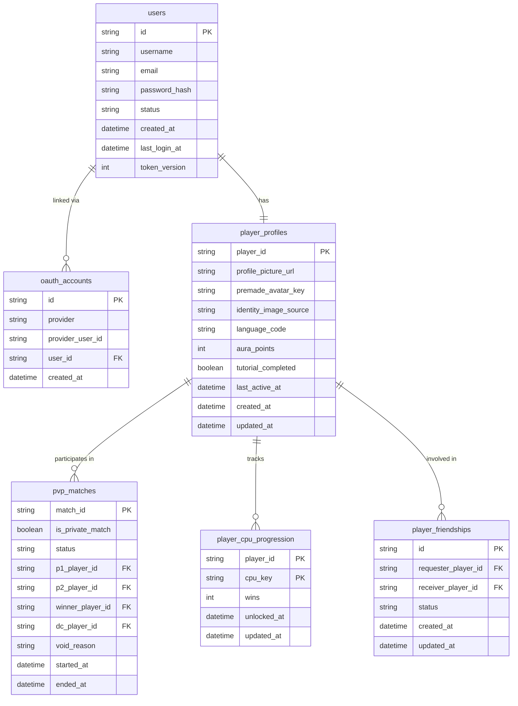

*This project has been created as part of the 42 curriculum by lnul-hak, dayeo, anteo, tlee.*

# Exponent — ft_transcendence

## Description

**Exponent** is a real-time multiplayer math combat game built as the final project of the 42 Common Core. Players compete in fast-paced arithmetic duels where speed and accuracy determine the winner. Every correct answer launches an attack; every unanswered question shocks both fighters. The platform supports live 1v1 remote matches, solo training against AI opponents with distinct personalities, a social friends system, community chat, a global leaderboard, and a fully internationalised interface in six languages.

**Key features:**
- Real-time 1v1 PvP arena with a server-authoritative WebSocket game engine
- Vs CPU mode with 4 distinct AI opponents: Min, Max, Fury, Shi-eld
- Attack mechanics: streak multipliers, defend windows, shock events, revenge mode
- Friends system with real-time online presence
- Community lobby chat
- Match history and per-player statistics
- Global leaderboard ranked by aura points
- 42 Intra OAuth login (alongside email/password)
- Internationalisation in 6 languages: English, Malay, Chinese, Spanish, French, Korean
- Interactive tutorial that teaches game mechanics before the first match
- Fully containerised — one command to launch the entire stack

---

## Instructions

### Prerequisites

| Requirement | Minimum version |
|---|---|
| Docker | 24+ |
| Docker Compose | v2 plugin (`docker compose`) |
| Google Chrome | Latest stable |
| 42 OAuth application | Register at `https://profile.intra.42.fr/oauth/applications` |

### 1 — Clone the repository

```bash
git clone <repo-url> ft_transcendence
cd ft_transcendence
```

### 2 — Configure the environment

```bash
cp .env.example .env
```

Open `.env` and fill in the required values:

| Variable | Description |
|---|---|
| `POSTGRES_PASSWORD` | Choose a strong PostgreSQL password |
| `JWT_SECRET` | Random string, minimum 32 characters |
| `FORTYTWO_CLIENT_ID` | From your 42 OAuth application |
| `FORTYTWO_CLIENT_SECRET` | From your 42 OAuth application |
| `HOST` | Your machine's LAN IP (must match the Docker OAuth redirect URI) |
| `HTTPS_PORT` | Port nginx publishes HTTPS on (default `8443`) |

In your 42 OAuth application, register **both** redirect URIs:
- Dev: `http://localhost:3001/auth/42/callback`
- Docker: `https://<HOST>:<HTTPS_PORT>/api/auth/42/callback`

### 3 — Launch the stack

```bash
make
```

This builds all four services (nginx, client, server, db) and starts them. Equivalent to `docker compose up --build`.

### 4 — Open the app

Navigate to `https://<HOST>:8443` in Google Chrome.  
Accept the self-signed TLS certificate warning (expected — the cert is generated at build time).

### Other commands

| Command | Description |
|---|---|
| `make down` | Stop and remove containers and networks |
| `make re` | Full teardown and rebuild from scratch |
| `make logs` | Follow logs from all services |
| `make ps` | Show service status |
| `make fclean` | Remove containers, networks, volumes, and locally built images |

### Local development (without Docker)

Requires Node.js 20+, pnpm 10+, and a running PostgreSQL 16 instance.

```bash
cp .env.example .env     # set DATABASE_URL to point at your local Postgres
pnpm install
pnpm dev                 # starts client (:3000) and server (:3001) in parallel
```

---

## Team Information

| 42 Login | Name | Role(s) |
|---|---|---|
| dayeo | Daniel | Product Owner |
| anteo | Angelly | Project Manager |
| lnul-hak | Luqman | Tech Lead / Developer |
| tlee | Teck Cheng | Product Tester / Developer |

### Responsibilities

- **dayeo (Daniel) — Product Owner**: Defined the product vision and feature priorities. Maintained the product backlog, validated completed work against requirements, and communicated scope decisions to the team. Led visual ideation sessions.

- **anteo (Angelly) — Project Manager**: Facilitated team coordination, organised meetings, tracked sprint progress and deadlines, and surfaced blockers. Maintained meeting minutes and architectural decision records in Notion. Led Figma wireframing.

- **lnul-hak (Luqman) — Tech Lead / Developer**: Defined the technical architecture and made all major technology decisions. Led implementation of the game engine, WebSocket infrastructure, authentication, API, CI/Docker setup, and database schema.

- **tlee (Teck Cheng) — Product Tester / Developer**: Validated features against requirements, identified bugs and edge cases through systematic testing, and contributed to feature development (match history, statistics, leaderboard).

---

## Project Management

The team ran a lightweight agile process for the duration of the project.

| Tool | Purpose |
|---|---|
| Notion | PRD, meeting minutes, architectural decision records |
| Figma | Low-fidelity wireframes and game UI visual exploration |
| GitHub Issues | Feature tracking, bug reports, and pull request reviews |
| Discord | Daily async communication and quick decisions |

---

## Technical Stack

### Frontend

| Technology | Version | Purpose |
|---|---|---|
| Next.js | 16 | App framework, file-based routing |
| React | 19 | UI component model |
| Tailwind CSS | 4 | Utility-first styling |
| Socket.IO Client | 4 | Real-time game and chat connection |
| Custom i18n system | — | Six-language internationalisation via React context |

### Backend

| Technology | Version | Purpose |
|---|---|---|
| Express | 5 | REST API and HTTP server |
| Socket.IO | 4 | WebSocket server for real-time features |
| Prisma | 7 | ORM and migration runner |
| Arctic | 3 | OAuth 2.0 client for 42 Intra |
| bcrypt | 6 | Password hashing |
| jsonwebtoken | 9 | JWT session tokens |
| zod | 4 | Runtime environment and input validation |
| sharp | 0.35 | Server-side image resizing for profile pictures |

### Database

**PostgreSQL 16** — chosen for its robust relational model, strong consistency guarantees, and first-class Prisma support. All primary keys use UUIDs to avoid enumerable ID attacks.

### Infrastructure

| Technology | Purpose |
|---|---|
| Docker + Docker Compose | Multi-service containerised stack |
| nginx 1.27 (alpine) | Reverse proxy, TLS termination, HTTP→HTTPS redirect |
| pnpm workspaces | Monorepo dependency management |

### Justification for key choices

- **Next.js over plain React** — provides the frontend framework point while giving us file-based routing and the option for SSR at no extra complexity cost.
- **Express 5 over NestJS** — lightweight and familiar to the team. The structural overhead of NestJS was not warranted at this project scale.
- **Prisma over raw SQL** — type-safe queries, auto-generated migrations, and a single source-of-truth schema file. Critical for a multi-developer project where schema drift is a real risk.
- **Socket.IO over raw WebSocket** — built-in rooms, namespaces, and reconnection handling saved significant boilerplate for the matchmaking and live game flows.
- **Monorepo (pnpm workspaces)** — `@repo/db` and `@repo/shared` packages are consumed by both client and server with full TypeScript type sharing and no duplication.

---

## Database Schema



### Table descriptions

**`users`** — The identity and authentication record. Stores credentials (hashed password, email, username) and a `token_version` integer that increments on logout, instantly invalidating all issued JWTs without needing a token blocklist. OAuth-only users have a `null` password hash.

**`oauth_accounts`** — Links a third-party identity (42 Intra) to a local user. One row per provider per user, keyed on `(provider, provider_user_id)`. A user can link multiple providers to the same account.

**`player_profiles`** — All game-related player data: avatar, language preference, aura points, and tutorial completion state. Separated from `users` so authentication concerns stay isolated from game concerns. Created automatically on signup.

**`pvp_matches`** — The complete history of every PvP match. Tracks both participants, the winner, and the player who disconnected (if any). A `status` of `voided` with a `void_reason` records matches ended by disconnect rather than gameplay. VS CPU matches are not stored here — CPU progress is tracked separately.

**`player_friendships`** — A self-referential table storing friend relationships. One row per pair regardless of direction; the application checks both orderings before inserting to prevent duplicates. The `status` field (`pending`, `accepted`, `declined`, `unfriended`) drives the full friend request lifecycle.

**`player_cpu_progression`** — Tracks how many times each player has beaten each CPU opponent, and when they first unlocked it. Uses a composite primary key `(player_id, cpu_key)`. One row per player/CPU pair is seeded on signup.

---

## Features List

### Authentication & Accounts

| Feature | Description |
|---|---|
| Email / password auth | Signup and login with bcrypt-hashed, salted passwords |
| 42 OAuth login | Login via 42 Intra using OAuth 2.0 with CSRF state validation |
| JWT session management | Stateless sessions with token versioning for instant invalidation on logout |

### Player Profile & Social

| Feature | Description |
|---|---|
| Player profile | View and edit username, email, and avatar (uploaded image or premade emoji) |
| Avatar upload | Profile picture upload with server-side resizing via Sharp |
| Friends system | Send, accept, decline, and remove friend requests; view friends list |
| Online presence | Real-time friend online/offline status via Socket.IO |
| Community chat | Real-time lobby chat for all connected players |

### Game — PvP

| Feature | Description |
|---|---|
| PvP matchmaking | Socket-based queue and room assignment for 1v1 quick matches |
| Private matches | Invite a specific friend to a private game session |
| Live game engine | Server-authoritative real-time arithmetic duel with attack, defend, shock, and revenge mechanics |
| Reconnection logic | Graceful disconnect handling with a timed recovery window before voiding the match |
| Match summary overlay | Post-game results screen showing accuracy, round, aura gain, and series score |

### Game — Vs CPU

| Feature | Description |
|---|---|
| Vs CPU mode | Play against 4 AI opponents with distinct personalities and difficulty levels |
| CPU unlock progression | Unlock harder opponents by defeating easier ones; progress persisted in DB |
| Tutorial | Scripted interactive walkthrough teaching all game mechanics before the first match |

### Statistics & Rankings

| Feature | Description |
|---|---|
| Match history | View past PvP match records with opponent, result, and date |
| Player statistics | Per-player win/loss record, accuracy stats, and aura points total |
| Global leaderboard | Rankings table sorted by aura points |

### Platform

| Feature | Description |
|---|---|
| Internationalisation | Six-language UI (EN, MS, ZH, ES, FR, KO) with in-app language switcher; preference persisted per user |
| Privacy Policy & Terms of Service | Accessible legal pages linked from the app |
| Responsive UI | Adaptive layouts for desktop and mobile using Tailwind CSS |
| Docker deployment | Single-command `make` launch of the full containerised stack behind nginx with HTTPS |

---

## Modules

### Module table

| # | Category | Module | Type | Points |
|---|---|---|---|---|
| 1 | Web | Framework — Next.js (frontend) + Express (backend) | Major | 2 |
| 2 | Web | Real-time WebSocket features via Socket.IO | Major | 2 |
| 3 | Web | User interaction — chat, profiles, friends system | Major | 2 |
| 4 | Web | ORM — Prisma with PostgreSQL | Minor | 1 |
| 5 | Accessibility & i18n | Multiple languages — EN, MS, ZH, ES, FR, KO | Minor | 1 |
| 6 | User Management | Standard user management — profile, avatar, friends, online status | Major | 2 |
| 7 | User Management | Game statistics and match history | Minor | 1 |
| 8 | User Management | OAuth 2.0 — 42 Intra | Minor | 1 |
| 9 | Artificial Intelligence | AI Opponent — 4 CPU personalities | Major | 2 |
| 10 | Gaming | Complete web-based game | Major | 2 |
| 11 | Gaming | Remote players — live 1v1 across separate machines | Major | 2 |
| | | **Total** | | **18** |

**14 points mandatory · 4 points bonus**

---

### Module justifications

#### 1 — Framework (Major, 2 pts)
Next.js 16 serves as the frontend framework (file-based routing, React server components, standalone Docker output). Express 5 serves as the backend framework (REST API, middleware pipeline). Both are used for their respective full capabilities, not as thin wrappers.

#### 2 — Real-time WebSocket features (Major, 2 pts)
Socket.IO drives three independent real-time flows: the matchmaking queue (player pairing and room creation), the live game engine (server-authoritative question/answer/event loop with sub-second round-trip), and the community chat. Connections and disconnections are handled gracefully; in-progress matches give the disconnected player a timed recovery window before the match is voided.

#### 3 — User interaction — chat, profiles, friends (Major, 2 pts)
The platform implements all three required sub-features: a real-time community chat (send/receive messages), a player profile system (view any player's stats and avatar), and a complete friends system (send, accept, decline, remove, view list with online status).

#### 4 — ORM — Prisma (Minor, 1 pt)
All database access goes through Prisma Client. The schema (`packages/db/prisma/schema.prisma`) is the single source of truth for all table definitions and relations. Migrations are managed via `prisma migrate`.

#### 5 — Multiple languages (Minor, 1 pt)
Six languages are fully supported in the UI: English (en), Malay (ms), Chinese Simplified (zh), Spanish (es), French (fr), and Korean (ko). All user-facing strings use translation keys resolved through a custom React context. Language preference is persisted in the database per user and applied on login.

#### 6 — Standard user management (Major, 2 pts)
Users can update their username, email, password, and avatar (uploaded image or premade emoji avatar). A dedicated profile page displays player information. The friends system shows real-time online/offline status for each friend.

#### 7 — Game statistics and match history (Minor, 1 pt)
Each player has a stats page showing win/loss record, accuracy, and aura points. A match history panel lists past PvP matches with opponent, result, and date. Statistics are aggregated from the `pvp_matches` table.

#### 8 — OAuth 2.0 — 42 Intra (Minor, 1 pt)
Login via 42 Intra is implemented using the Arctic OAuth 2.0 library. The flow uses CSRF state validation, issues a JWT on success, and links the 42 account to a local user row via `oauth_accounts`. OAuth-only users can set a password later through account settings.

#### 9 — AI Opponent (Major, 2 pts)
Four distinct CPU personalities are implemented server-side in `apps/server/src/config/cpu-opponents.config.ts`:

| CPU | Fighter type | Behaviour |
|---|---|---|
| Min | Vanilla | 75% accuracy, slow answers, no defend or streak. Entry-level opponent. |
| Max | Streak builder | 75% accuracy, builds answer streaks for higher damage. |
| Shi-eld | Block specialist | 90% accuracy, high block chance, goes weak briefly after blocking. |
| Fury | Avenge | 90% accuracy, revenge mode always active, critical hit chance at max power. |

The AI simulates human-like imperfection: it answers with calibrated delays, occasionally misses by 1–3, and uses game mechanics (defend, revenge) according to its personality. It is not a hardcoded script but a parameterised decision engine evaluated on the server game loop.

#### 10 — Complete web-based game (Major, 2 pts)
Exponent is a real-time arithmetic combat game. Two players (or a player and a CPU) answer math questions to attack. Mechanics include: streak attack multipliers, defend activation windows (blocks CPU attacks, stuns the attacker), shock events (both players lose HP when neither answers in time), and revenge mode (bonus damage after absorbing enough hits). Matches end when one player's HP reaches zero. Win/loss conditions are unambiguous and the game runs entirely in the browser with no plugins required.

#### 11 — Remote players (Major, 2 pts)
Two players on separate machines join a shared server-side Socket.IO room. All game state — HP, events, damage values, status effects, timestamps — is computed on the server and broadcast to both clients simultaneously. Network latency is absorbed by the server's event timestamping. Disconnection is detected immediately; the opponent is notified and a recovery window is granted before the match is voided.

---

## Individual Contributions

### lnul-hak (Luqman) — Tech Lead / Developer
- Implemented authentication: email/password (bcrypt + JWT with token versioning), 42 OAuth (Arctic, CSRF state), session cookie flow
- Built all REST API routes: auth, profile, friends, stats, leaderboard, OAuth
- Set up the full Docker infrastructure: Compose stack, nginx reverse proxy with HTTPS, HTTP→HTTPS redirect, self-signed TLS at build time
- Configured all Prisma migrations and seeding logic

### dayeo (Daniel) — Product Owner
- Authored and maintained the Product Requirements Document (PRD) in Notion, including feature definitions, acceptance criteria, and priority decisions
- Validated completed features against requirements and coordinated feedback cycles
- Created low-fidelity game screens, navigation flows, and avatar selection UI

### anteo (Angelly) — Project Manager
- Set up the monorepo structure to facilitate our development.
- Organised and facilitated all team meetings; maintained structured meeting minutes and decision logs in Notion
- Tracked sprint progress, managed the GitHub Issues board, and surfaced blockers to the team
- Coordinated visual design direction and maintained design consistency across Figma deliverables

### tlee (Teck Cheng) — Product Tester / Developer
- Built the WebSocket layer: matchmaking queue, room management, live event broadcasting, reconnection and void logic
- Implemented the match history page and statistics dashboard (client and API integration)
- Built the global leaderboard page with aura-points ranking
- Conducted systematic functional testing across all features; filed and tracked GitHub Issues for defects
- Validated edge cases: disconnect handling, voided matches, accuracy edge cases, and i18n coverage

---

## Resources

### Technical references

- [Next.js Documentation](https://nextjs.org/docs)
- [Express.js Documentation](https://expressjs.com)
- [Prisma Documentation](https://www.prisma.io/docs)
- [Socket.IO Documentation](https://socket.io/docs)
- [Arctic — OAuth 2.0 library](https://arcticjs.dev)
- [42 Intra OAuth API Documentation](https://api.intra.42.fr/apidoc)
- [Tailwind CSS Documentation](https://tailwindcss.com/docs)
- [Docker Compose Documentation](https://docs.docker.com/compose)
- [PostgreSQL 16 Documentation](https://www.postgresql.org/docs/16)
- [JSON Web Tokens — RFC 7519](https://datatracker.ietf.org/doc/html/rfc7519)
- [OAuth 2.0 PKCE — RFC 7636](https://datatracker.ietf.org/doc/html/rfc7636)
- [OWASP Top Ten](https://owasp.org/www-project-top-ten/)

### AI usage

AI tools were used throughout the project to accelerate specific tasks. In all cases the team reviewed, tested, and took full responsibility for the output before it was incorporated.

| Task | Tool | How it was used |
|---|---|---|
| Rapid game prototyping | ChatGPT | Generated low-fidelity interaction models to quickly test game pacing and mechanic feel before committing to implementation |
| UI visual generation | Image generation AI | Produced candidate game UI visuals used as reference during Figma ideation sessions |
| Game mechanics development | AREN (custom GPT) | Iteratively developed and stress-tested mechanic rules — attack multipliers, shock conditions, revenge timing — before encoding them in the server engine |
| PRD development | Krystalize (custom Claude skill) | Structured and fleshed out the Product Requirements Document, ensuring feature definitions were precise and testable |
| Implementation & debugging | Claude Code | Used for rapid implementation of boilerplate (route handlers, Prisma queries, socket event handlers), debugging runtime errors, and code review |
